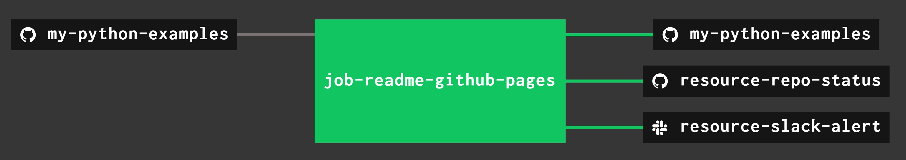

# my-python-examples

[](https://codeclimate.com/github/JeffDeCola/my-python-examples)
[](https://codeclimate.com/github/JeffDeCola/my-python-examples/issues)
[](https://goreportcard.com/report/jeffdecola/my-python-examples)
[](https://godoc.org/github.com/JeffDeCola/my-python-examples)
[](http://jeffdecola.mit-license.org)

`my-python-examples` _is a place to keep my python code snippets and examples._

[GitHub Webpage](https://jeffdecola.github.io/my-python-examples/)

# EXAMPLES

* [xxx](https://github.com/JeffDeCola/my-python-examples/tree/master/xxxx)

   _xxxxx._

## TESTED USING CONCOURSE

A Concourse Pipeline will automate unit testing and update the GitHub WebPage.



A _ci/.credentials.yml_ file needs to be created for your _slack_url_ and _repo_github_token_.

Use fly to upload the the pipeline file _ci/pipline.yml_ to Concourse:

```bash
fly -t ci set-pipeline -p my-python-examples -c ci/pipeline.yml --load-vars-from ci/.credentials.yml
```

## CONCOURSE RESOURCES IN PIPELINE

`my-python-examples` also contains a few extra concourse resources:

* A resource (_resource-slack-alert_) uses a [docker image](https://hub.docker.com/r/cfcommunity/slack-notification-resource)
  that will notify slack on your progress.
* A resource (_resource-repo-status_) use a [docker image](https://hub.docker.com/r/dpb587/github-status-resource)
  that will update your git status for that particular commit.

The above resources can be removed from the pipeline.
